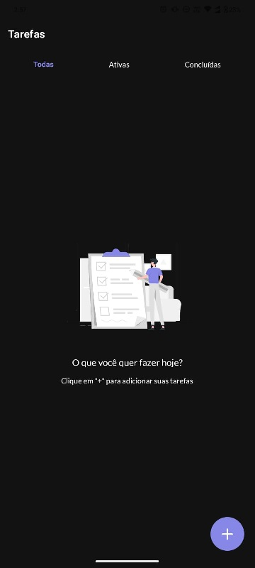
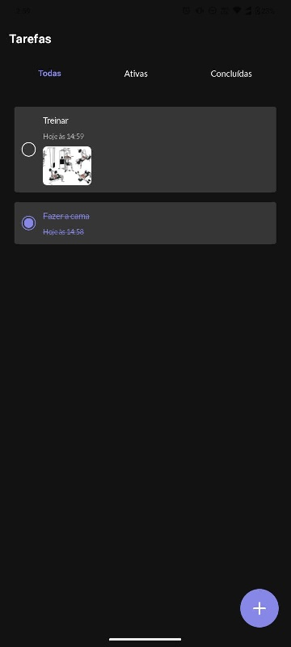
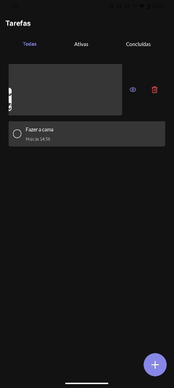
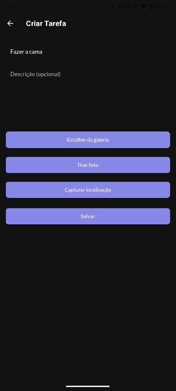
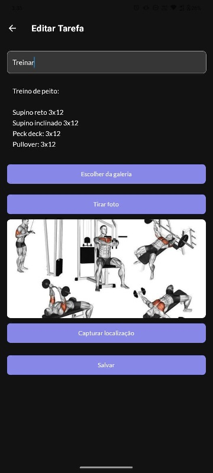
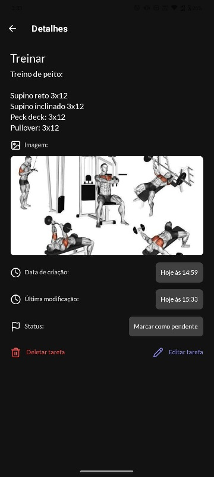

# UpTodo Application 2025

Aplicativo de tarefas simples desenvolvido em React Native com persistência local usando AsyncStorage.

--

## 1. Como instalar e rodar o projeto

1. Clone o repositório:

```sh
git clone git@github.com:fcrfabiano/UPTODO_APPLICATION_2025.git
cd UPTODO_APPLICATION_2025
```

2. Instale as dependências:

```sh
npm install
# ou
yarn
```

3. Execute o projeto:

```sh
npm run start       # abre o menu do Expo
npm run android     # roda no Android
npm run ios         # roda no iOS
# ou
yarn start
yarn android
yarn ios
```

Certifique-se de ter o Expo CLI instalado globalmente (`npm install -g expo-cli`) e um emulador ou dispositivo físico configurado.

--

## 2. Tecnologias e bibliotecas escolhidas

- *React Native*: para desenvolvimento multiplataforma (iOS, Android e Web).
- *Expo*: simplifica o build, deploy e teste do app.
- *React Navigation*: para navegação entre telas.
- *AsyncStorage*: para persistência local de tarefas.
- *NativeWind / TailwindCSS*: estilização rápida e responsiva.
- *Lucide React Native*: ícones leves e consistentes.
- *MD5*: Geração de uuids, implementei meu próprio algoritmo.
- *Reanimated / Gesture Handler*: para animações e gestos fluidos.

A escolha dessas bibliotecas se deu pelo equilíbrio entre *facilidade de uso*, *performance e manutenção futura*.

--

## 3. Como implementei a persistência

O app utiliza *AsyncStorage* para salvar e carregar as tarefas localmente.

- `saveTasks(tasks: Task[])` grava a lista de tarefas.
- `loadTasks(): Promise<Task[]>` carrega as tarefas salvas.
- O `TaskContext` gerencia o estado global das tarefas com `useReducer` e `useContext`.
- Qualquer alteração (criar, atualizar, deletar, marcar concluída) dispara a atualização no AsyncStorage automaticamente.

```ts
useEffect(() => {
    if (!state.loading) {
        saveTasks(state.tasks).catch((e) => console.error(e));
    }
}, [state.tasks, state.loading]);
```

## 4. Desafios que enfrentei e como resolvi

- *Persistência assíncrona*: precisei garantir que o `AsyncStorage` não travasse a interface. Resolvido usando `useEffect` e `useCallback`.
- *Atualização de estado complexo*: para atualizar ou deletar tarefas, precisei iterar cuidadosamente sobre o array sem quebrar a imutabilidade.
- *Sincronização de data/hora*: ao atualizar tarefas, o campo `updatedAt` é atualizado automaticamente.

--

## 5. O que faria diferente com mais tempo

- Faria uma arquitetura melhor, usaria *DDD* e *MVVM*. Usaria o conceito de entidades e repositórios do DDD para manter as tarefas salvas. Também utilizaria os conceitos do MVVM para separar a lógica dos componentes do componente em si, e aplicaria testes.
- Melhoraria a *UI/UX* com animações mais suaves e feedback visual para o usuário.

## 6. Tempo total investido

*1 dia*

## 7. Screenshots do App

Aqui estão algumas telas do UpTodo Application 2025:

*Tela Inicial*

A tela principal mostra todas as tarefas, com opção de marcar como concluída, visualizar detalhes e deletar quando faz o swipe para o lado esquerdo.





*Adicionar Nova Tarefa*

O usuário pode criar novas tarefas com título e descrição.



*Edição de Tarefa*

Permite atualizar o título ou a descrição de tarefas existentes.



*Tarefas Concluídas*

Visualização das tarefas já concluídas, podendo reativá-las ou deletá-las.


*Visualizar Tarefa*

Visualização das tarefas já concluídas, podendo reativá-las ou deletá-las.

